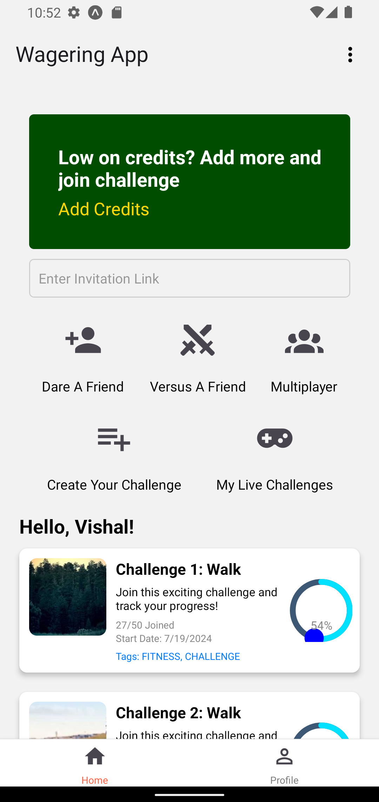

# Wagering App

This Wagering App is built using React Native and Expo. The app allows users to join various challenges, track their steps, and wager credits. It includes features such as user authentication, game details, and progress tracking.

## Table of Contents

- [Features](#features)
- [Installation](#installation)
- [Dependencies](#dependencies)
- [Running the App](#running-the-app)
- [Project Structure](#project-structure)
- [Screens](#screens)
- [API Endpoints](#api-endpoints)
- [Auth Flow](#auth-flow)
- [License](#license)

## Features

- User Authentication (Login/Signup)
- Game Cards Listing
- Game Details View
- Step Tracking Integration
- Wagering and Credits System
- Profile and Settings Management
- Bottom Tab Navigation

## Installation

Follow these steps to set up and run the Wagering App on your local machine:

### Prerequisites

Ensure you have the following installed:

- Node.js (v12.x or later)
- npm (v6.x or later) or yarn (v1.x or later)
- Expo CLI

### Steps

1. **Clone the Repository**

   ```bash
   git clone https://github.com/your-username/wagering-app.git
   cd wagering-app

   ```

2. **Project Structure**

```project structure
wagering-app/
├── assets/
├── components/
│ ├── GameCard.js
│ ├── TopSection.js
│ └── ...
├── context/
│ ├── AuthContext.js
├── navigation/
│ ├── AuthStack.js
│ ├── MainStack.js
│ ├── BottomTabStack.js
│ └── ...
├── screens/
│ ├── Auth/
│ │ ├── LoginScreen.js
│ │ ├── SignupScreen.js
│ ├── Main/
│ │ ├── HomeScreen.js
│ │ ├── ProfileScreen.js
│ │ ├── GameDetailScreen.js
│ │ └── ...
├── App.js
└── ...
```

## Screens

### Home Screen

Displays a list of game cards with a "View More Challenges" button.

### Profile Screen

Shows user profile information and settings.

### Game Detail Screen

Provides detailed information about a specific game, including start date, tags, image, description, and more.

## Dependencies

- **React Navigation:** For navigation and routing.
- **React Native Paper:** For UI components.
- **AsyncStorage:** For persistent storage.
- **Expo Sensors:** For step tracking integration.
- **Axios:** For API requests.

## API Endpoints

### User Authentication

- `POST /auth/login`: User login
- `POST /auth/signup`: User signup

### Game Management

- `POST /user/gameJoin`: Join a game
- `PATCH /game/updateScore`: Update score by user ID
- `GET /game/details`: Fetch game details by ID and title

## Authentication Flow

- **Login/Signup:** Users can log in or sign up.
- **Token Storage:** On successful authentication, the token and user data are stored in AsyncStorage.
- **Navigation:** Based on the authentication status, the app navigates to the appropriate stack (`MainStack` or `AuthStack`).

## Running the App

To run the app:

1. Ensure the Expo server is started:
   ```bash
   expo start
   ```
2. Scan the QR code using the Expo Go app on your mobile device, or use an Android/iOS simulator.

## License

This project is licensed under the MIT License.

````vbnet
Feel free to integrate this into your existing `README.md` file or create a new one. This section pr

# Wagering App

This Wagering App is built using React Native and Expo. The app allows users to join various challenges, track their steps, and wager credits. It includes features such as user authentication, game details, and progress tracking.

## Table of Contents

- [Features](#features)
- [Installation](#installation)
- [Dependencies](#dependencies)
- [Running the App](#running-the-app)
- [Project Structure](#project-structure)
- [Screens](#screens)
- [API Endpoints](#api-endpoints)
- [Auth Flow](#auth-flow)
- [License](#license)

## Features

- User Authentication (Login/Signup)
- Game Cards Listing
- Game Details View
- Step Tracking Integration
- Wagering and Credits System
- Profile and Settings Management
- Bottom Tab Navigation

## Installation

Follow these steps to set up and run the Wagering App on your local machine:

### Prerequisites

Ensure you have the following installed:

- Node.js (v12.x or later)
- npm (v6.x or later) or yarn (v1.x or later)
- Expo CLI

### Steps

1. **Clone the Repository**

   ```bash
   git clone https://github.com/your-username/wagering-app.git
   cd wagering-app

````

2. **Project Structure**

```project structure
wagering-app/
├── assets/
├── components/
│ ├── GameCard.js
│ ├── TopSection.js
│ └── ...
├── context/
│ ├── AuthContext.js
├── navigation/
│ ├── AuthStack.js
│ ├── MainStack.js
│ ├── BottomTabStack.js
│ └── ...
├── screens/
│ ├── Auth/
│ │ ├── LoginScreen.js
│ │ ├── SignupScreen.js
│ ├── Main/
│ │ ├── HomeScreen.js
│ │ ├── ProfileScreen.js
│ │ ├── GameDetailScreen.js
│ │ └── ...
├── App.js
└── ...
```

## Screens

### Home Screen

{:height="400px" width="200px"}

Description of the Home Screen functionality and features.

### Profile Screen

{:height="400px" width="200px"}

Description of the Challenges Screen functionality and features.

### Game Detail Screen

{:height="400px" width="200px"}

Description of the Game Detail Screen functionality and features.

## Dependencies

- **React Navigation:** For navigation and routing.
- **React Native Paper:** For UI components.
- **AsyncStorage:** For persistent storage.
- **Expo Sensors:** For step tracking integration.
- **Axios:** For API requests.

## API Endpoints

### User Authentication

- `POST /auth/login`: User login
- `POST /auth/signup`: User signup

### Game Management

- `POST /user/gameJoin`: Join a game
- `PATCH /game/updateScore`: Update score by user ID
- `GET /game/details`: Fetch game details by ID and title

## Authentication Flow

- **Login/Signup:** Users can log in or sign up.
- **Token Storage:** On successful authentication, the token and user data are stored in AsyncStorage.
- **Navigation:** Based on the authentication status, the app navigates to the appropriate stack (`MainStack` or `AuthStack`).

## Running the App

To run the app:

1. Ensure the Expo server is started:
   ```bash
   expo start
   ```
2. Scan the QR code using the Expo Go app on your mobile device, or use an Android/iOS simulator.

## License

This project is licensed under the MIT License.

```vbnet
Feel free to integrate this into your existing `README.md` file or create a new one. This section pr

```
